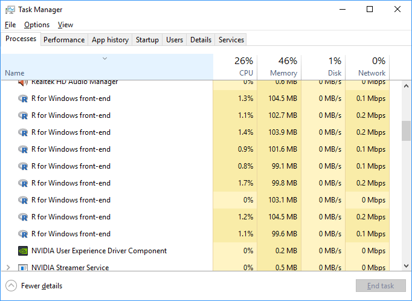

```{r setup, include=FALSE, width = 50}
knitr::opts_chunk$set(echo = TRUE)

```
<style type="text/css">
.showopt {
  background-color: #004c93;
  color: #FFFFFF; 
  width: 100px;
  height: 20px;
  text-align: center;
  vertical-align: middle !important;
  float: right;
  font-family: sans-serif;
  border-radius: 8px;
}

.showopt:hover {
    background-color: #dfe4f2;
    color: #004c93;
}

pre.plot {
  background-color: white !important;
}
</style>

<script src="hideOutput.js"></script>

```{r}
```
<center>
##Do Critical Reviews of Music Relate to Actual Listenership?
</center>  


#####There are plenty of music review sites out there (as well as ones for movies, books, games, etc.).  We can find hundreds of online and print magazine and newspapers that have reviews, review aggregration sites like Metacritic, as well as sites like AllMusic, which has critical reviews of literally hundreds of thousands of music albums.  So clearly, one might wonder if so many people are critiquing music, does it influence what people might listen too?  Obviously causation is an impossible thing to prove via pulling data from the web, so this effort will concentrate on a simpler question, do the ratings of critics (which presumably corresponds to the text in their written reviews), have any correlation with what music people listen?  Basically does music that critics rate highly, correspond with increased listening from the public at large?

#####To do this research two websites will be used that contain great quantities of data to mine.  AllMusic.com (<http://www.allmusic.com/>) as mentioned has reviews of essentially all major popular works (Bryan Adams excepted, apparently he has some issue with All Music, and an interesting google search...), down to reviews of things that are extraordinarily obscure.  So this site was chosen to be the source for critical ratings.  The site last.fm (<http://www.last.fm>) has an api, which among many other things allows one to retrieve the number of listeners to a particular album, as well as the number of plays for that album.


####Hypothesis
#####The basic null hypothesis for this research would be that critics do not influence listenership, and the alternate would be that critics do influence listenership, i.e.:

* H~0~ $\mu$~diff~ = 0:  Critics do **not** influence listening habits.
* H~A~ $\mu$~diff~ $\neq$ 0: Critics do influence listening habits.

#####Not to prejudge the research, but some of the inherent cynicism in the author leads him to believe we will not be rejecting the null hypothesis.  And if pictures are worth some number of words, here are a couple of pairs:

###2.5 Stars, 290k Listeners:
```{r, echo=F, out.width = "350px"}

knitr::include_graphics("demilastfm.png")
```

###4 Stars, 6k listeners:
```{r, echo=F, out.width = "350px"}


```


###Components of the project.

#####There are four main ".r" files that do the work of the project.  The data scraped or pulled form the API are stored in a MongoDB Database, which is then used as source for the analysis part of the code.  The files and "collections" are below:
* R-Files
    + readAllMusic.R, this scrapes the web page of AllMusic.  The main methods it has are:
        - buildArtistList, this is a **recursive** function that take in an artist as a "seed", and finds all the artists Allmusic feels are related to this artist, and then for each of those artists, it calls itself to find all the artists those artists are related, and so on.  It quickly grows exponentially fast and is controlled by a depth parameter of how many times the function should call itself recursively.  A depth of 6 can easily get you 5000 or more artists.
        - getRelatedArtists, called by buildArtistList, and this function actually does the scraping of AllMusic to get related artists.  
        - getRelatedArtists, this function scrapes allMusic to return a dataframe of: "Artist", "Album", "Year" (of album), and "Critic Rating", for a given artist.  
        - addRatingsToArtists, this loops through a passed in list of artistURLS and calls the above function on each and rbinds each dataframe passed in.  (Note that isn't really an efficient way to build the dataframe, but the major part of time is the scraping anyhow...)
        - And misc support functions
    + lastFM_API.R, this reads the lastfm API.  The code for this is much simpler than the allmusic scraping code.  It uses the lastFM JSON API to get JSON data for each artist's album.
        - getAPIString, builds an URI for the lastfm API, based on passed in album and artist
        - readLastFM_JSON, this calls and gets an API string from the above function, calls the API and returns a JSON object (hopefully).
        - populateLastFMTable, take in a vector of an artist/album, calls the above function, and inserts that returned JSON into a Mongo db table.
        - And misc utility functions
    + meldRatingsVUse.R, this file uses the other two files above to drive the scraping and pulling of data from the API.  There are 4 main functions involved in doing that:
        - populateArtistCollection, this function takes a seed URL of an artist on the allmusic page and calls the buildArtistList function to get a list of related Artist URLs.  It then parses out the artist's name and loads the list of URL's and artist names to a MongoDB collection.
        - populateArtistRepository, this calls the addRatingsToArtists with a vector of artist URLS and takes the resultant dataframe and inserts it into R.
        - populateFMDataFromAMTable, **Cool**, this function uses parallel processing, and it reads albums from MongoDB collection and does an apply and calls populateLastFMCollection to read the lastFM api, for each album and populate the relevant MongoDB collection.
        - meshAMFM, takes the values from the AllMusic table and the LastFMData table and combines the fields needed from both for analysis and puts them in a table call AMFMCombined.
    + analysisRatingsListens.R is the file that actually does the analysis, after all the above work is done.  It does it using the saved data in the MongoDB, as trying to do it while scraping the web obviously is time prohibitive.  
    + utilities.r, contains just a couple functions used in common places in the code
   
#####Source Code "readAllMusic.R"
<div class="fold s">
```{r eval=F}
library(XML)
library(stringr)
library(RCurl)
library(selectr)
library(rvest)
library(mongolite)
#library(jsonlite)
source("utilities.r")


seedURL <-"http://www.allmusic.com/artist/nick-cave-mn0000397880"
setwd("L:\\school\\cuny\\607\\finalproj - Mongo")

mongoURL <- "mongodb://localhost:27017/MusicScrapings"
mongoDB <- "MusicScrapings"
collection <- "AllMusic"

# Mongo Section -------


getAlbumsBefore2000 <- function()
{
    mongoConnection("AllMusic")$find('{"Year": { "$lt": "2000" } }')
}

getAlbums <- function()
{
    mongoConnection("AllMusic")$find()
}


getArtistURLs <- function()
{
    return(mongoConnection("Artists")$find(fields = '{"_id" : 0, "ArtistsURL" : 1}'))
}

# allmusic Scraping Section ----

getRootHTML <- function(artistURL)
{
    html <- getURL(artistURL,
                   useragent = str_c(R.version$platform,
                                     R.version$version.string,
                                     set=", "))
    root <- NULL
    try(root <- xmlRoot(htmlParse(html)))

    return(root)
}

getArtistRepository <- function(artistURL)
{
    artistRootHTML <- getRootHTML(str_c(artistURL, "/discography"))
    #exit if nothing returned
    if (is.null(artistRootHTML)) return(NULL)
    
    artistName <- xpathApply(artistRootHTML,'//*[@id="cmn_wrap"]/div[1]/div[2]/header/div/hgroup/h1', xmlValue )
    artistName <- str_replace_all(artistName, "\n +|  +", "")
    #header <- xpathSApply(artistRootHTML, "//table/tr/th", xmlValue)
    
    #get year
    #year <- xpathApply(artistRootHTML, '//*[contains(concat( " ", @class, " " ), concat( " ", "year", " " ))]', xmlValue)
    year <- str_trim(xpathApply(artistRootHTML, '//*[@id="cmn_wrap"]/div[1]/div[2]/section/table/tbody/tr/td[3]', xmlValue))
    
    #get album names
    albums <- xpathSApply(artistRootHTML, '//*[@id="cmn_wrap"]/div[1]/div[2]/section/table/tbody/tr/td[4]/a[1]', xmlValue)
    
    #rating is 2nd attr of this section
    criticRatings <- xpathSApply(artistRootHTML, '//*[@id="cmn_wrap"]/div[1]/div[2]/section/table/tbody/tr/td[6]', xmlAttrs)[2,]
    #ratings is first numeric value, and is from 0-9, so add 1 to make 1-10  (actual values on screens are 5 stars, which can have 1/2 values)
    criticRatings <- as.numeric(str_extract(criticRatings, "[[0-9]]")) + 1
    
    
    # #user ratings are not "in the html_doc...", they are a css class, that is probably "jqueried" when the page is loaded
    # userRatings <- xpathSApply(artistRootHTML, '//*[@id="cmn_wrap"]/div[1]/div[2]/section/table/tbody/tr/td[7]', xmlAttrs)[2,]
    # userRatings <- as.numeric(str_extract(userRatings, "[[0-9]]")) + 1
    
    
    df <- data.frame(artistName, year, albums, criticRatings, stringsAsFactors = FALSE)
    colnames(df) <- c("Artist", "Year", "Album", "critcRatings")#, "userRatings")
    return(df[complete.cases(df),])
}


#pass in list of artist allmusic URL's returns df with artists albums, and ratings, both critics and user
addRatingsToArtists <- function(lArtistsURL)
{
    df <- getArtistRepository(lArtistsURL[1])
    for(idx in 2:length(lArtistsURL))
    {
         df<- rbind(df, getArtistRepository(lArtistsURL[idx]))
         if ((idx %% 100) == 0) print (str_c("iteration " , idx))  #since this can take forever...status
    }
    
    return(df)

}


#returns a list of artists "related" the artist passed in
getRelatedArtists <- function(artistURL)
{
    relatedRootHTML <- getRootHTML(str_c(artistURL, "/related"))
    relatedAddr <- NULL
    if (!is.null(relatedRootHTML))
    {
        relatedAddr <- xpathSApply(relatedRootHTML, '//*[@id="cmn_wrap"]/div[1]/div[2]/section[1]/ul/li/a', xmlAttrs)[1,]
    }
    return(relatedAddr)
}


#recursive, list will grow fast as well as execution time if depth is much higher than small single digits
#note artists param is meant to be used by the function itself during recursion, the initial call does not need to populate
buildArtistList <- function(url, depth, artists = url)
{
    #print("call build artist2")
    related <- getRelatedArtists(url)
    if (is.null(related) | depth ==0) 
        return(related)
    
    depth <- depth -1
    
    while(length(related) > 0)
    { 
        if(length(artists[artists == related[1]]) < 1)
        {
            artists <- unique(c(artists, buildArtistList3(related[1], depth, c(related[1], artists))))
    
        }
        related <- related[-1]
    }
    
    return(artists)
}


#6degreesofBacon ----

perform6DegreesOfBacon <- function()
{
    baconList <- buildArtistList("http://www.allmusic.com/artist/the-bacon-brothers-mn0000044295/", 6)
    dfBacon <- as.data.frame(baconList, stringsAsFactors = F)
    colnames(dfBacon) <- "ArtistsURL"
    dfBacon$ArtistName <- str_extract(dfBacon[,], "artist/.*") %>% 
        str_replace("artist/", "") %>% 
        str_replace("-mn.*", "") %>% 
        str_replace_all("-", " ") %>%
        simpleCap()
    conn <- mongoConnection("SixDegreeBacon")
    insertMongo(conn, dfBacon, T)
    
}
```
</div>
   
#####Source Code "lastFM_api2.R"

<div class="fold s">
```{r eval=F}
setwd("L:\\school\\cuny\\607\\finalproj - Mongo")
library(RCurl)
library(XML)
library(stringr)
library(RJSONIO)
library(mongolite)
library(parallel)
source("utilities.R")


#sample syntax
#http://ws.audioscrobbler.com/2.0/?method=album.getinfo&api_key=YOUR_API_KEY&artist=Cher&album=Believe&format=json

baseURL <- "http://ws.audioscrobbler.com/2.0/?method=album.getinfo&api_key="
setwd("L:\\school\\cuny\\607\\finalproj - Mongo")
apiFile <- "lastfmapi.txt"
apiKey <- (scan(apiFile, what = "character", quiet = T))


# Mongo Section -------

mongoURL <- "mongodb://localhost:27017/MusicScrapings"
mongoDB <- "MusicScrapings"
fmCollection <- "LastFMData"

getLastFM <- function()
{
    return(mongoConnection("LastFMData")$find())
}


#Scraping Section ---


parseJSON <-function (contents)
{
    results <- NULL
    try( results <-  fromJSON(contents, simplify = FALSE))
    
    return(results)
}

getAPIString <- function(artist, album) 
{
    concatURI <- str_c(baseURL, apiKey,  "&artist=", artist, "&album=", album, "&format=json")
    concatURI <- str_replace_all(concatURI, " ", "%20")  #replace space with encoding 
    return(concatURI)
}

readLastFM_JSON <-function(vArtistAlbum)
{
    concatURI <- str_c(baseURL, apiKey,  "&artist=", vArtistAlbum[1], "&album=", vArtistAlbum[2], "&format=json")
    concatURI <- str_replace_all(concatURI, " ", "%20")   #replace space with encoding
    return(parseJSON(getURI(concatURI)))
}

#populates table in mongo with results from the album info method of the lastfm api
populateLastFMCollection <- function(vArtistAlbum, mConn)
{
    results <- readLastFM_JSON(vArtistAlbum)
    if(!is.null(results))
    {
        insertMongo(mConn, results)
    }
}


#populates the count of listens and plays for a given artist/album combination
#currently not used in project as whole
getListenPlayCounts <- function(artist, album)
{
    #key <- readApiKeyFromFile("lastfmapi.txt")
    results <- readLastFM_JSON(artist, album)
    return(c(results$album$listeners, results$album$playcount))
    
}


# Testing Code -----

populateFMMongoFromFile <- function()
{
    insertMongo(mongoConnection(fmCollection), read.csv("meshed.csv", stringsAsFactors = F), T)
}


```
</div>

#####Source Code "meldRatingsVUse.R": 

<div class="fold s">
```{r eval=F}
setwd("L:\\school\\cuny\\607\\finalproj - Mongo")
source("lastFM_API2.r")
source("readAllMusic.r")
source("utilities.r")
library(parallel)
#library(snow)

seedURL <-"http://www.allmusic.com/artist/nick-cave-mn0000397880"
setwd("L:\\school\\cuny\\607\\finalproj - Mongo")
#mongoURL <- "mongodb://localhost:27017/MusicScrapings"
#mongoDB <- "MusicScrapings"


getCompleteFMCases <- function()
{
    df <- mongoConnection(fmCollection)$find(fields = '{"_id" : 0, "album.name" : 1, "album.artist" :1, 
                                             "album.listeners": 1, "album.playcount" : 1  }')
    #above returns df of 1 column that is vector of 4, transform
    df <- data.frame(cbind(unlist(df[,1][1], use.names = F),
                           unlist(df[,1][2], use.names = F),
                           unlist(df[,1][3], use.names = F),
                           unlist(df[,1][4], use.names = F)),
                     stringsAsFactors = F)
    cNames <- c("Album", "Artist", "Listeners",  "Plays")
    colnames(df) <- cNames
    
    df <- df[complete.cases(df),]
    return(df[complete.cases(df),])
}


# Calls function in readAllMusic.r, to get a list of related artists and then pops in mongo collection
# params:
#   * seed_URL, starting allmusic artist page
#   * collection, mongo colleciton name to insert the generated list
#   * depth, how many levels do we want go down, for related artists
#   * overwrite, overwrite or append to mongo collection
populateArtistCollection <- function(seedURL, collection, depth, overWrite = F)
{
    artists <- buildArtistList(seedURL, depth)
    dfArtists <- as.data.frame(artists, stringsAsFactors = F)
    colnames(dfArtists) <- "ArtistsURL"  
    #pull artist name from URL
    dfArtists$ArtistName <- lapply(dfArtists[,1], function(x) str_extract(x, "artist/.*") %>% 
                                       str_replace("artist/", "") %>% 
                                       str_replace("-mn.*", "") %>% 
                                       str_replace_all("-", " ") %>%
                                       simpleCap())
    
    conn <- mongoConnection(collection)
    insertMongo(conn, dfArtists, overWrite)
}


#calls function in readAllMusic.r to get a list of albums per artist, and critic ratings
#populates mongo collection with that info
# params
# * vArtistUrls, char vector of artist urls to allmusic
# * collection is name of mongo collection to store results
# * overwrite, overwrite or append to mongo collection
populateArtistRepository <- function(vArtistURLs, collection, overWrite = F)
{
    dfArtistRepository <- addRatingsToArtists(vArtistURLs)
    conn <- mongoConnection(collection)
    insertMongo(conn, dfArtistRepository, overWrite)
}

#can't resist the pun
meshAMFM <-function(dfAM, dfFM)
{
    
    conn <- mongoConnection("AMFMCombined2")
    
    dfAMUpper <- dfAM
    dfAMUpper$Artist <- toupper(dfAM$Artist)
    dfAMUpper$Album <- toupper(dfAM$Album)
    dfMesh <- NULL
    for(idx in 1:nrow(dfFM))
    {
        AMfull <-unique(dfAM[dfAMUpper$Artist == toupper(dfFM$Artist[idx])
                       & dfAMUpper$Album == toupper(dfFM$Album[idx])
                       ,])[1,]
        AM <- cbind(AMfull$critcRatings, AMfull$Year)
        
        if(complete.cases(AMfull))
        {
            amfm <- cbind(dfFM[idx,], AM)
            colnames(amfm)[colnames(amfm) == 1] <- "CriticRating"
            colnames(amfm)[colnames(amfm) == 2] <- "Year"
            insertMongo(conn, amfm)
        }
    }
}


# ----


populateFMDataFromAMTable <- function()
{
    albums <- getAlbums()
    cluster <- makeCluster(9)
    clusterEvalQ(cluster, {
        source("lastFM_API2.r")
        source("readAllMusic.r")
        source("utilities.r")
        library(parallel)
    })
    parApply(cluster, albums[,c("Artist", "Album")], 1, populateLastFMCollection, mongoConnection(fmCollection))
    stopCluster(cluster)
}

#These 6 statements below do all the populating of the tables in mongo, with arist, and album info, 
#with six levels of artists references, i.e, start with seed artist, get all artists which allmusic 
#thinks are related, get all the related artists to those artists, and do 5 more times

#populateArtistCollection(seedURL, "Artists", 6, T)
#populateArtistRepository(getArtistURLs()[,1], "AllMusic")
#populateFMDataFromAMTable()
#dfAllMusic <- getAlbums()
#dfLastFM <- getCompleteFMCases()
#meshAMFM(dfAllMusic,dfLastFM)
```
</div>

#####Source Code "analysisRatingsListens.R": 

<div class="fold s">
```{r eval=F}
library(mongolite)
library(stringr)
setwd("L:\\school\\cuny\\607\\finalproj - Mongo")
source("utilities.r")
        

mongoURL <- "mongodb://localhost:27017/MusicScrapings"
mongoDB <- "MusicScrapings"
fmCollection <- "LastFMData"


getAlbumYear <- function(album, artist)
{
    #mongoConnection("AllMusic")$find('{"Year": { "$lt": "2000" } }')
    
    artist<- str_replace_all(artist, '"', '')
    album <- str_replace_all(album, '"', '')
    
    q <- str_c('{"Artist" : { "$eq" : "' , artist, '"}}' )
    
    
    df <- mongoConnection("AllMusic", verbosity = F)$find(query = q,
                                     fields = '{"_id" : 0, "Year": 1, "Album": 1 }')
    
    if(nrow(df)>0)
        return(as.numeric(unique(df[toupper(df$Album) == toupper(album),][1,1])))
    else
        return(NA);
    
    
        
}


#This is a horrible way to do it :(  Mongo is way to slow for this kind of work (at least without indexing and other tuning)
#will do once and add a table (aka collection)
#not actually used
addYears <- function(df)
{
    df$Year <- NA
    df$Year <- mapply(getAlbumYear, df$Album, df$Artist)
    return(df)
    
}


subsetByLargeAlbumCount <- function()
{
    dfReturn <- NULL
    distinctArtists <- unique(artists$Artist)
    for(idx in 1:length(distinctArtists))
    {
        dfArtist <- artists[artists$Artist == distinctArtists[idx],]
        if(nrow(dfArtist)>7)
        {
            dfReturn <- rbind(dfReturn, dfArtist)
        }
    }
    return(dfReturn)
}


individualRegression <- function(dfArtists)
{
    dfArtistsCor <- NULL
    
    distinctArtists <- unique(dfArtists$Artist)
    
    
    for(idx in 1:length(distinctArtists))
    {
        df <- dfArtists[dfArtists$Artist == distinctArtists[idx],]
        lmL <- lm(df$Listeners ~ df$CriticRating)
        lmP <- lm(df$Plays ~ df$CriticRating)
        sumL <- summary(lmL)
        sumP <- summary(lmP)
        sumL$df[2]
        dfCor <- cbind(distinctArtists[idx],  cor(df$CriticRating, df$Listeners), cor(df$CriticRating, df$Plays), 
                       lmL$coefficients[1], lmL$coefficients[2], sumL$df[2], sumL$r.squared,
                       lmP$coefficients[1], lmP$coefficients[2], sumP$df[2], sumP$r.squared)
        
        
        dfArtistsCor <- rbind(dfArtistsCor, dfCor)
    }
    cNames <- c("Artist", "CriticVListnerCorr", "CriticVPlayCorr", "ListenerIntercept", 
                "ListenerCoefficient", "DFListener", "RSQListener",
                "PlayIntercept", "PlayCoefficient", "DFPlay", "RSQPlay")
    colnames(dfArtistsCor) <- cNames
    return(as.data.frame(dfArtistsCor, stringsAsFactors = F))
}

# sample analysis code ----

# 
# artists <- mongoConnection("AMFMCombined")$find()
# artists$Year <- as.numeric(artists$Year)
# artists$Listeners <- as.numeric(artists$Listeners)
# artists$Plays <- as.numeric(artists$Plays)
# artists$CriticRating <- as.numeric(artists$CriticRating)
# cor(artists$CriticRating, artists$Listeners)
# cor(artists$CriticRating,artists$Plays)
# lmArtistsL <- lm(artists$Listeners ~ artists$CriticRating)
# lmArtistsP <- lm(artists$Plays ~ artists$CriticRating)
# summary(lmArtistsL)
# summary(lmArtistsP)
# 
# median(artists$Listeners)
# median(artists$Plays)
# 
# options(scipen = 5)
# hist(artists$Listeners, breaks= 30, ylim = c(0, 10000), xlim = c(0,1000000), xlab = "Listeners")
# hist(artists$Plays, breaks= 50, ylim = c(0, 10000), , xlim = c(0,10000000), xlab = "Plays")
#multiAlbumArtists <- subsetByLargeAlbumCount()
# artistsCor <- individualRegression(multiAlbumArtists)
# sum(as.numeric(artistsCor$CriticVListnerCorr)) / nrow(artistsCor)
# sum(as.numeric(artistsCor$CriticVPlayCorr)) / nrow(artistsCor)
# sum(as.numeric(artistsCor$RSQListener)) / nrow(artistsCor)
# sum(as.numeric(artistsCor$RSQPlay)) / nrow(artistsCor)


```

#####Source Code "utilities.R": 

<div class="fold s">
```{r eval=F}
library(mongolite)
mongoURL <- "mongodb://localhost:27017/MusicScrapings"
mongoDB <- "MusicScrapings"
#from "R" help in toupper function
simpleCap <- function(x) 
{
    s <- strsplit(x, " ")[[1]]
    paste(toupper(substring(s, 1, 1)), substring(s, 2),
          sep = "", collapse = " ")
}


mongoConnection <- function(coll = collection, verbosity = T)
{
    return(mongo(coll, mongoDB, mongoURL, verbose = verbosity ))
}

insertMongo <-function(mongConn, df, drop = F)
{
    if(drop)
    {
        try(mongConn$drop())
    }
    mongConn$insert(df)
    
}
```

* MongoDB Collections
    + Artists, has fields of ArtistURL and Artist Name
    + AllMusic, has fields of "Artist", "Year" (of album), "Album", and "CriticRatings"
    + LastFMData,  holds, the album related info from the lastfm api.  Has field of album, with relavant sub fields being "name", "artist", "listeners", and "playcount". 
    + AMFMCombined, is the collection used for analysis.  Contains fields, Album, Artist, Listeners, Plays, CriticRating, and Year.


###The Biggest Project Problem and How It Was Overcome
####And a Cool Ability Learned in R
</center>

####Web Scraping is Slow...
```{r, echo=F, out.width = "150px"}

```

####Enter Parallel Processing 

#####The biggest problem encountered was the sheer length of time the webscraping and pulling of data from the API--this was an extremely time consuming process.  Two solutions were available, one, was to consume less data, the other was to consume it faster.  While I didn't necessarily need all the data I pulled to work on the project, clearly, being able to pull large amounts of data quickly is useful.  The solution I found is the **parallel** package in R. And this does what it's name implies, it allows you to run a task over a dataset, (or vector or matrix), with multiple items processing at once.

####What's it good for:
#####This parallel process isn't going to compensate if your CPU is already running to max capacity, but if you are processing things with a lot of overhead (network tasks, db reading), this can help a lot.  My ability to quickly use the lastfm API was not CPU or network bound, but rather the overhead of making a connection, being authenticated, transferring data over the internet, and so forth.  Running in parallel reduced calling time by a factor nearly equal to the number of parallel processes started.

####It's actually really simple :) 
#####The code to use it in this project is below, and the package is actually really simple to use once it is understood.  Basically to get it up and running requires only four functions:
* makeCluster, with a param of how many clusters (AKA how many parallel processes) one wants to run.  
* clusterEvalQ, here you load a bunch of commands to "bootstrap" each cluster, basically allocating the environment with what one needs to execute your parallel tasks.
* parApply (or similar parSapply, parLapply, etc.), which is a parallel version of apply, with the same parameters except you pass it your group of clusters from the makeCluster function.
* stopCluster, stops the clusters from running.  If you start your clusters in a function and don't do this, they will run until you terminate R Studio (or otherwise terminate the root from where these started), as you no longer have a reference to stop them.

####Things to Know:

There are a couple of things to understand with this process.  The first, is each cluster starts R "naked" basically, as if you had just started R itself, and has no libraries loaded, and no functions and variables defined.  In Windows to make sure your cluster has the environment it needs, you need to pass commands to load them up, see the code below with the source and library calls specified.  In Unix (or Mac), the process is simpler, you can run a function, makeForkCluster, which will load  (fork) all your current environment variables into the new clusters.

The second, and this is an really **easy way to force yourself into an instant reboot** if messed up, is to make sure you don't call your process to create clusters from within the files being sourced (or even in the code you are executing in the clusters).  Basically, you end up in an infinite loop of the code calling itself and spawning new processes, and it isn't likely you will be fast enough to terminate them in task manager before 2 more have spawned.

####Sample code from project, that implements parallel processing:  

<div class="fold s">
```{r, eval=F}
populateFMDataFromAMTable <- function()
{
    albums <- getAlbums()
    cluster <- makeCluster(9)
    clusterEvalQ(cluster, {
        source("lastFM_API2.r")
        source("readAllMusic.r")
        source("utilities.r")
        library(parallel)
    })
    parApply(cluster, albums[,c("Artist", "Album")], 1, populateLastFMCollection, mongoConnection(fmCollection))
    stopCluster(cluster)
}


```
</div>


####Here is how it looks in Windows Task Manager:  
```{r, echo=F, out.width = "525px"}

```    

###Statistical Analysis:

#####Let's look at how the critical ratings and listenership correlate.   We will use the data from the AMFMCombined table to do our analysis.


```{r}
source("utilities.r")
artists <- mongoConnection("AMFMCombined", verbosity = F)$find()
artists$Year <- as.numeric(artists$Year)
artists$Listeners <- as.numeric(artists$Listeners)
artists$Plays <- as.numeric(artists$Plays)
artists$CriticRating <- as.numeric(artists$CriticRating)
```


#####Let's first look at the correlation between both the number of actual listeners to an album, with regards to the critic rating from AllMusic, and then the equivalent between actual times played of an album, versus the critic rating.

####Correlation Rating V Listeners
```{r}
cor(artists$CriticRating, artists$Listeners)
```
####Correlation Rating V Plays
```{r}
cor(artists$CriticRating,artists$Plays)
```

#####Looks somewhat promsing as the correlation is positive, although we are talking just a little over 10%.  So lets dig some more and fit a linear model.

```{r}
lmArtistsL <- lm(artists$Listeners ~ artists$CriticRating)
lmArtistsP <- lm(artists$Plays ~ artists$CriticRating)
```
####Summary of LM for Rating V Listeners
```{r}
summary(lmArtistsL)
```
####Summary of LM for Rating V Plays
```{r}
summary(lmArtistsP)
```

####Promsing Results?
#####At first glance this looks promising.  Both summaries show a coefficient that has a large number attached to it, about 10,000 for listeners and 176000 for plays, and both of the PR values for those are essentially nil.  **BUT**, look at the R-Sqaured value, it is under 2% for each case, meaning the critics ratings explain next to nothing regarding the values of the listeners and plays of a given album.   Looking at the Intercept being highly negative for both cases likely explains a lot.  
#####Both distributions (see histograms below) are extremely right skewed (also implying extreme cases), which does perhaps affect the good fitting of a line model, and the **extreme** difference between the mean and median also demonstrate this.
```{r}
library(stringr)
options(scipen = 5)
print(str_c("Median Listeners: ", round(median(artists$Listeners),0), " vs mean: ", round(mean(artists$Listeners),0)))
print(str_c("Median Plays: ", round(median(artists$Plays),0), " vs mean: ", round(mean(artists$Plays),0)))
hist(artists$Listeners, breaks= 30, ylim = c(0, 40000), xlim = c(0,1000000), xlab = "Listeners")
hist(artists$Plays, breaks= 50, ylim = c(0, 40000), , xlim = c(0,10000000), xlab = "Plays")
```

#####Doing a plot of the data, also doesn't really give us any confidence that we are seeing a correlateion:
```{r}
  plot(artists$Listeners ~ artists$CriticRating, xlab = "Critic Ratings", ylab = "Listeners", main = "Critic Ratings V Listeners")
  abline(lmArtistsL)
  plot(artists$Plays ~ artists$CriticRating, xlab = "Critic Ratings", ylab = "Plays", main = "Critic Ratings V Plays")
  abline(lmArtistsP)
```

####Conclusion
#####So any realistic assessment of this relationship, is that even if the summary statistics showed some slight correlation between critical ratings and listeners or plays of albums, the influence is so small as to be realistically meaningless.

####Another Thought...

#####What might be more interesting though, is whether there is a correlation for a given artist's works and the ratings of albums given by critics.  For music as a whole, obviously many factors play into the an analysis, clearly very popular artists are going to get more plays for any of their works, just because they are a known entity and better promoted, whereas lesser known artists perhaps can live in obscurity even if talented as know one knows about them.

####So some additional analysis was done, by creating a data table of the correlation between various albums of a given artist, and the critical rating of each of them.  

####While we are not going to do a full analysis of this data, we will show some quick statistics that do prove more interesting than the analysis at large did.

#####Here is the source to do that individualized regression.  
<div class="fold s">
```{r}
subsetByLargeAlbumCount <- function()
{
    dfReturn <- NULL
    distinctArtists <- unique(artists$Artist)
    for(idx in 1:length(distinctArtists))
    {
        dfArtist <- artists[artists$Artist == distinctArtists[idx],]
        if(nrow(dfArtist)>7)
        {
            dfReturn <- rbind(dfReturn, dfArtist)
        }
    }
    return(dfReturn)
}


individualRegression <- function(dfArtists)
{
    dfArtistsCor <- NULL
    
    distinctArtists <- unique(dfArtists$Artist)
    
    
    for(idx in 1:length(distinctArtists))
    {
        df <- dfArtists[dfArtists$Artist == distinctArtists[idx],]
        lmL <- lm(df$Listeners ~ df$CriticRating)
        lmP <- lm(df$Plays ~ df$CriticRating)
        sumL <- summary(lmL)
        sumP <- summary(lmP)
        sumL$df[2]
        dfCor <- cbind(distinctArtists[idx],  cor(df$CriticRating, df$Listeners), cor(df$CriticRating, df$Plays), 
                       lmL$coefficients[1], lmL$coefficients[2], sumL$df[2], sumL$r.squared,
                       lmP$coefficients[1], lmP$coefficients[2], sumP$df[2], sumP$r.squared)
        
        
        dfArtistsCor <- rbind(dfArtistsCor, dfCor)
    }
    cNames <- c("Artist", "CriticVListnerCorr", "CriticVPlayCorr", "ListenerIntercept", 
                "ListenerCoefficient", "DFListener", "RSQListener",
                "PlayIntercept", "PlayCoefficient", "DFPlay", "RSQPlay")
    colnames(dfArtistsCor) <- cNames
    return(as.data.frame(dfArtistsCor, stringsAsFactors = F))
}
```
</div>

First we retrieve artists with 7 or more albums to make sure each set is at least minimally sized, and then we run a regression on each artist individually.  Here are the first few lines of the result, and while they are just a handful, they look at lot more promising than the set as a whole, with correlations generally higher and R-Squared values higher.

```{r}
multiAlbumArtists <- subsetByLargeAlbumCount()
artistsCor <- individualRegression(multiAlbumArtists)
head(artistsCor)
```

Let's take a look at the average correlation for both critical rating versus listenership, and critial rating versus plays, and then look at the average R-Squared value for the same.

<div class="fold s">
```{r}
print(str_c("Correlation between rating and listenership: ", round(sum(as.numeric(artistsCor$CriticVListnerCorr)) / nrow(artistsCor),2), " and the correlation between rating and plays is: ", round(sum(as.numeric(artistsCor$CriticVPlayCorr)) / nrow(artistsCor),2), "."))

print(str_c("The R-Squared value of the linear fitted model for rating versus listenership is: ", round(sum(as.numeric(artistsCor$RSQListener)) / nrow(artistsCor),2), " while for ratings versus plays is: ", round(
sum(as.numeric(artistsCor$RSQPlay)) / nrow(artistsCor),2), "."))
```
</div>

#####While this is not definitive by any measure, it does appear promising that correlation of critic ratings for artist's albums correlate with more frequent plays and listeners.  That is, given two albums for a given artist, the one with the higher rating corresponds to an album more listened to.


###Just For Fun...Six Degrees of Kevin Bacon

#####Since we scraped allmusic.com by going to an given artist and drilling down level by level into all the related artists, this sound idea sounds suspiciously like the Six Degrees of Kevin Bacon meme.  So Allmusic.com was searched this way for Kevin Bacon (note he is actually in a band called The Bacon Brothers).  

#####Alas, while Kevin may know everyone in HollyWood, he apparently only knows 5148 musicians....clearly only a small fragment of the music world :)

#####Here is the code snippet that does that:

<div class="fold s">
```{r eval=F}
perform6DegreesOfBacon <- function()
{
    #buildArtistList is the function that is used for the other scraping of artists
    baconList <- buildArtistList("http://www.allmusic.com/artist/the-bacon-brothers-mn0000044295/", 6)
    dfBacon <- as.data.frame(baconList, stringsAsFactors = F)
    colnames(dfBacon) <- "ArtistsURL"
    dfBacon$ArtistName <- str_extract(dfBacon[,], "artist/.*") %>% 
        str_replace("artist/", "") %>% 
        str_replace("-mn.*", "") %>% 
        str_replace_all("-", " ") %>%
        simpleCap()
    conn <- mongoConnection("SixDegreeBacon")
    insertMongo(conn, dfBacon, T)
}
```
</div

